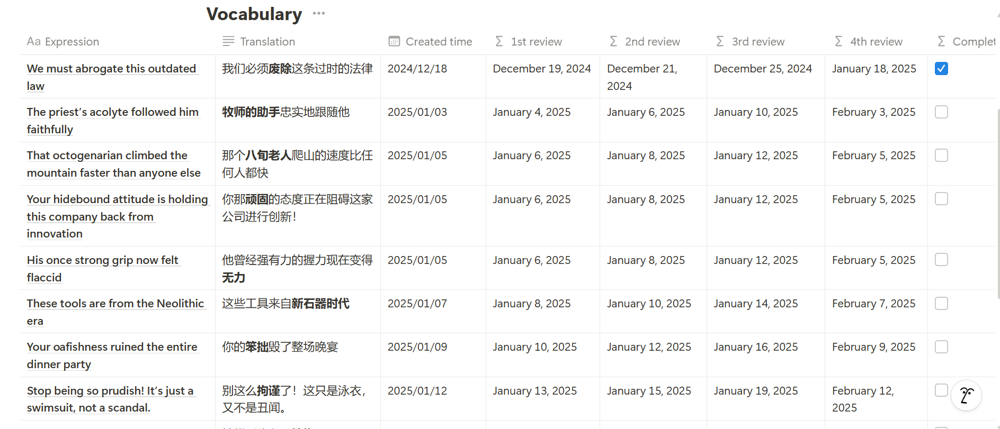
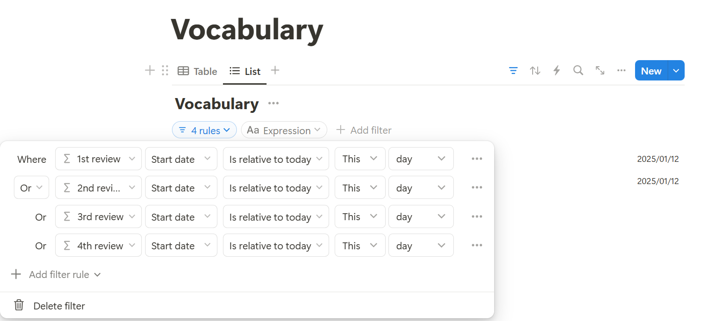
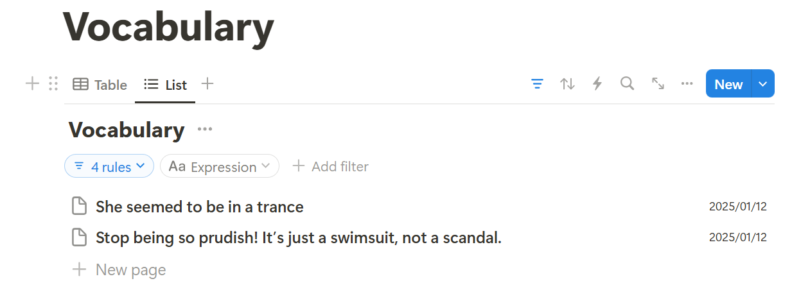

---
date:
  created: 2025-01-19
---

# How I'm Using Notion to Get My English Back: A Simple 20-Minute Daily System

I got my master's degree in interpreting between Chinese and English almost 10 years ago. But then I switched to programming and gradually lost touch with English over the years. I watched my once-fluent English skills gradually slip away.  After years of minimal English practice, I decided it was time for a comeback starting from the beginning of 2025 (with the help of Notion of course) 

<!-- more -->

## 1. The Challenge of Language Maintenance

Let's be honest — languages are like muscles. Without regular exercise, they weaken. Despite my professional background in interpretation, years of focusing solely on coding left my English skills rusty.

So I developed a straightforward system using Notion to rebuild my language skills starting from the beginning of 2025. Here's how I organize my daily 20-minute English practice, which might be helpful for others in similar situations.

## 2. The Basic Framework

My approach is intentionally simple:

* Memorizing new vocabulary for 20 minutes every day on the train to the office

* Watching English shows with subtitles turned off and collecting unfamiliar words when eating dinner

**Smart Spaced Repetition System**

I created a database that automatically schedules review sessions at  intervals:

- Day 1
- Day 3
- Day 7
- Day 30

This systematic approach ensures I'm reviewing words just as I'm about to forget them, maximizing retention efficiency.

## 3. The Notion Setup

### 3.1 Vocabulary Database

I created a spaced repetition system that automatically schedules reviews at specific intervals:

 

/// caption

A screenshot of the vocabulary database.

///

Each vocabulary entry includes:

- Expression (a sentence containing target word)
- Translation (a proper translation of the sentence)
- 1st review to 4th review date (automatically generated)
- Completed (whether today has past the 4th review date)

### 3.2 Daily memorizing task

/// caption

By setting filter rules in the List view, as shown in the image, I can see only the words I need to review each day

///

/// caption

This is what it looks like for daily review. If I am not sure about the meaning of a sentence, just click it to see its translation.

///

## 4. Why Notion Became My Chosen Learning Companion

**Beautiful and Familiar Interface**

I've been using Notion to take notes for years and it's both functional and beautiful. The aesthetic appeal of Notion isn't just about looks - it actually motivates me to maintain my study habit. There's something satisfying about having your learning materials organized in a visually pleasing way.

**Progress Tracking** 

   Notion helps me:

- Monitor my daily study streaks
- Track words learned and mastered
- Visualize my progress over time

## 5. Limitations and Considerations

Let's talk about the elephant in the room — no system is perfect, and I want to be totally honest about where this one could use some improvements.

**The "Perfect Streak" Challenge**

Right now, I'm on fire with my reviews - haven't missed a day since 2025 started! But let's be real - life happens. That's why I'm planning to add tracking columns in my database to monitor when I actually complete each review. It's not about beating myself up over missed days, but rather about having a clear picture of my consistency.

**Keeping It Casual (On Purpose)**

If you're familiar with Anki, you might be thinking, "Hey, this isn't as sophisticated as Anki's algorithm!" And you're absolutely right. While Anki is brilliant at adapting to how well you know each word, I deliberately chose a simpler approach. As a former Anki user myself, I wanted something more relaxed this time around. Sometimes, making things too "serious" can take the fun out of learning!

**The Trade-offs I'm Okay With**

- The system is intentionally basic - no fancy algorithms here
- It doesn't track how well I know each word
- It's more about building a sustainable habit than achieving perfect retention

Here's the thing - I'd rather have a simple system I actually use than a perfect one I might abandon. For me, this sweet spot between structure and flexibility works better than a more rigid approach. The goal isn't to create the most sophisticated learning system - it's to actually get my English skills back!

[^1]: Disclaimer: the blog is written by myself and then polished by AI