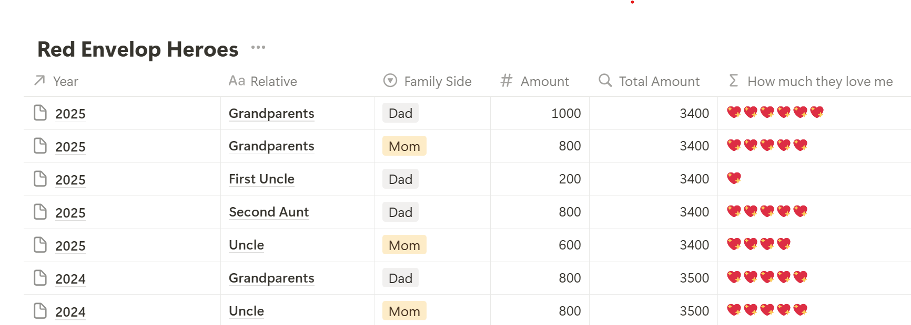

---
date:
  created: 2025-01-29
description: Learn how to use Notion for students to track Chinese New Year red envelopes with a fun database system. Perfect Notion template showing how to create rollup formulas and relationship databases. Ideal for students learning database management with real-world examples.
---

# Tracking Affection from Relatives During Chinese New Year - Harder Than I Thought

Happy Lunar New Year, fellow red envelope warriors! 🧨✨ 

(For those who knows little about Chinese culture, red envelopes containing cash are gifts from the elderly to children or unmarried adults)

This year, I’m turning my chaotic cash grab into a science. And by “science,” I mean a Notion database named **Red Envelop Heroes**, because *someone* needed to quantify which auntie loves me most. Let me tell you: Nothing says “holiday spirit” like a spreadsheet.

<!-- more -->

In this blog post, I’ll show you how I built a Notion database—cleverly named **“Red Envelop Heroes”**—to record and calculate:

1. The total amount of lucky money I received each year.
2. A fun emoji-based “love meter” that indicates how much that relative adores me (in a whimsical way, of course).

## Database Overview

Let’s look at the **Red Envelop Heroes** database example:



`Total Amount` is the sum of cash I received for that year. 

`How Much They Love Me`  represents the proportion of each relative's red envelope amount to the total amount for that year.

## Challenge #1: Calculating Total Annual Cash Flow 💸

To calculate `How Much They Love Me`, I first need to sum over the `Amount` of each year.

I didn't realize that you can't simply sum over some values in a column as part of a formula until I wanted to create this database, which means calculating the sum of money I received each year is not a easy task.

To make this simpler, I had to create another database called `Yearly Summary` and use Notion relation & rollup :


* **_Total Amount** is a rollup (summing the `Amount` from “Red Envelop Heroes”).
* **Total Amount** is a formula column that simply calculates `sum(prop("_Total Amount"))`. In this case, it just gets the value in `_Total Amount`
* Back in the **Red Envelop Heroes** database, the **Total Amount** column references **Yearly Summary**’s **Total Amount** field via a rollup. I can’t directly call **_Total Amount** (Notion restrictions), so I used a “proxy” formula column in the **Yearly Summary** database.

It is pretty difficult to clearly explain how to set up the two databases and connect them using rollup. If you can't understand what I did, leave me a comment.

## Challenge #2: Translating Cash to “Love” (💖💔)

Here’s where I got petty. The formula for **“How Much They Love Me”** using emoji:

```
slice(
	["💖","💖","💖","💖","💖","💖","💖","💖","💖","💖"], 
	0, 
	round(prop("Amount")/prop("Total Amount").at(0) * 20)
).join("")  
```

Translation: The bigger the red packet, the more hearts. Simple. Brutal. *Mathematically ruthless.*

**Example:**

- ¥1000 out of ¥3400 ≈ **6 hearts** (Grandparents = family royalty).
- ¥200 out of ¥3400 = **1 heart** (*First Uncle, we need to talk*).

## Why This Isn’t Just a Money Grab

This Chinese New Year, I’m not just collecting cash—I’m collecting *data*. And honestly? It’s made the holiday *more* meaningful. Now, when Grandpa hands me a red envelope, I don’t just see money. I see 6 hearts. 💖

So grab your laptop, fire up Notion, and let’s turn generosity into analytics. Just… maybe don’t show the results to your relatives.